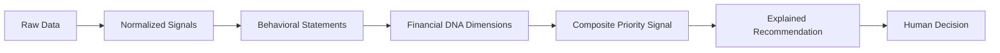
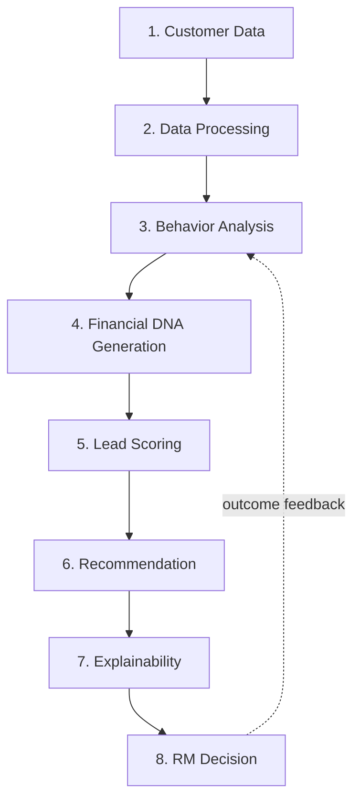
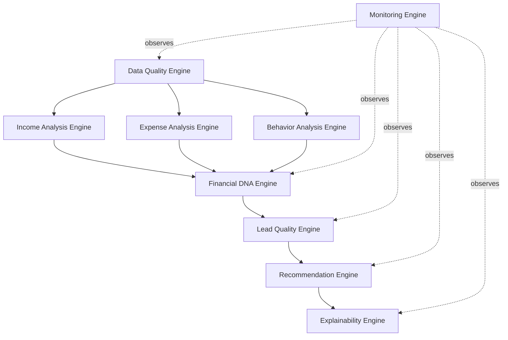
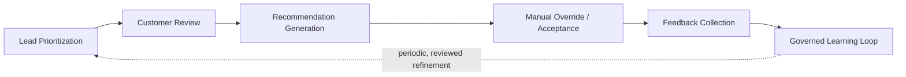

# ProspectIQ AI
## Product Technical Blueprint (PTB)

**Project:** ProspectIQ AI (working name)
**Hackathon:** IDBI Innovate 2026 — Track: Prospect Assist AI
**Document Type:** Product Reasoning & Intelligence Blueprint — the bridge between business requirements and software architecture
**Governing Documents:** Product Requirements & Context Bible (PRCB), Project Constitution, Software Requirements Specification (SRS)
**Status:** Draft for Architecture Team Handoff

> **Source note:** As with the SRS, this PTB was requested to be derived in part from a "Product Backlog & Feature Blueprint" that has not been provided in this conversation. Every framework, engine, and pillar defined below is derived directly from the PRCB (behavioral philosophy, alternative data sources, explainability strategy) and the SRS (approved functional and AI requirements). No new feature capability is introduced anywhere in this document — every engine and pillar maps to an existing FR/AIR from the SRS, referenced inline. Where a design choice was needed that neither source document specifies, it is marked **[PTB DESIGN CHOICE]** to distinguish product-reasoning design from approved requirements.

---

## 1. Executive Summary

The PRCB defines *what* ProspectIQ AI is and *why* it exists. The SRS defines *what* the system must do, requirement by requirement. Neither document explains *how the product thinks* — how a stream of raw, messy banking and alternative data actually becomes a trustworthy sentence an RM reads on a Tuesday morning before making a call.

That gap is what this document closes.

The Product Technical Blueprint exists because architecture cannot be designed correctly from requirements alone. A requirements list tells an architect *that* a Behavioral Financial DNA profile must be generated (SRS FR-006); it does not tell them *how the product reasons* from seven disconnected data sources into one coherent, explainable profile, or *what happens* when three of those sources disagree with each other. Without this reasoning model made explicit, different engineers will encode different, inconsistent mental models of the product into the codebase — which is precisely the failure mode the Project Constitution was written to prevent.

This document is therefore the **single reasoning specification** from which the System Architecture Document, AI/ML design, and service boundaries should be derived without ambiguity. It contains no APIs, no database schemas, and no code — only the product's logic, structured so an architecture team can translate it into services without having to re-derive product intent themselves.

---

## 2. Product Thinking Model

ProspectIQ AI's core intellectual move is a single transformation, repeated at scale: **turning disconnected, low-context financial signals into one coherent, explainable behavioral narrative about a person or business.**

Most systems in this space stop at aggregation — they collect data and expose it. ProspectIQ AI's thinking model insists on a further step: every piece of aggregated data must be converted into a *behavioral statement* (e.g., not "₹45,000 average monthly UPI outflow" but "spending has been stable and predictable for the past four months") before it is allowed to influence a recommendation. Raw numbers are treated as intermediate state, never as end products.

This model has one non-negotiable rule baked into it: **nothing crosses the boundary from step D to step F without carrying its own explanation forward with it.** A score with no attached narrative is treated as an incomplete artifact, not a valid output — this is the mechanism by which Constitution §5 and §15 ("never bypass explainability") are enforced at the reasoning level, before a single line of architecture is written.

---

## 3. Core Product Workflow

The full journey from raw customer data to an RM's decision follows eight stages. Each stage has a single responsibility and hands off a well-defined artifact to the next.

| Stage | Responsibility | Artifact Produced | Traces To |
|---|---|---|---|
| 1. Customer Data | Ingest traditional and alternative source data | Raw records per source | SRS FR-007 |
| 2. Data Processing | Normalize, validate, reconcile conflicting/missing data | Clean, structured behavioral data | SRS FR-007 |
| 3. Behavior Analysis | Convert time-series data into behavioral statements | Behavioral indicators (trend-based, not point-in-time) | SRS FR-008 |
| 4. Financial DNA Generation | Synthesize behavioral indicators into the Financial DNA profile | BFD Profile (Section 5) | SRS FR-006, FR-009 |
| 5. Lead Scoring | Apply the scoring methodology (Section 7) to the BFD profile | Prioritization score + confidence | SRS FR-010, FR-012 |
| 6. Recommendation | Translate score into an actionable, bounded recommendation | Readiness indicator, priority tier | SRS FR-022 |
| 7. Explainability | Generate grounded, human-readable rationale | Explanation object (Section 8) | SRS FR-011 |
| 8. RM Decision | Human reviews, acts, or overrides | Engagement outcome / override record | SRS FR-005, FR-013 |

Stage 8 feeds back into Stage 3 over time, not by auto-updating live models mid-flight (which would violate AIR-011's governance boundary), but by enriching the training and evaluation data used in periodic, governed model refinement cycles.

---

## 4. Product Intelligence Framework

ProspectIQ AI's proprietary reasoning framework is the **Behavioral Intelligence Framework (BIF)**. BIF is the organizing structure that governs how every data source, regardless of origin, gets converted into decision-usable intelligence. It has four pillars.

| Pillar | Purpose | Inputs | Outputs | Business Value | Dependencies |
|---|---|---|---|---|---|
| **1. Signal Integrity** | Guarantee that every downstream conclusion rests on validated, traceable data — never silently corrupted or fabricated input. | Raw traditional and alternative data (SRS FR-007) | Validated, source-tagged behavioral data | Prevents an entire class of trust failures before they can propagate; protects RM confidence in the system | Data source availability, ingestion pipelines |
| **2. Behavioral Synthesis** | Convert validated data into the Financial DNA profile — the product's core intellectual asset. | Validated behavioral data | Financial DNA Profile (Section 5) | Encodes the PRCB's central philosophy ("behaviour over raw numbers") directly into the product | Pillar 1 output |
| **3. Prioritization Reasoning** | Convert a Financial DNA profile into a ranked, confidence-scored signal an RM can act on. | Financial DNA Profile | Priority score, confidence, readiness indicator | Directly drives the core business KPI: RM time allocated to the right prospects | Pillar 2 output |
| **4. Explainable Delivery** | Ensure every output of Pillar 3 is delivered with a grounded rationale, never as a bare number. | Priority score, contributing DNA dimensions | Explanation object (Section 8) | This is what makes the system usable and defensible inside a regulated bank — the differentiator named explicitly in the PRCB (§31–32) | Pillar 3 output |

No pillar may be skipped. An architecture that allows Pillar 3 output to reach an RM without passing through Pillar 4 is, by definition, not implementing BIF correctly — this is the reasoning-level equivalent of Constitution Non-Negotiable "never bypass explainability."

---

## 5. Financial DNA Framework

The **Financial DNA (FDNA) Framework** is the structured model behind the Behavioral Financial DNA profile referenced throughout the PRCB and SRS (FR-006). It has eight dimensions. Each dimension is a behavioral lens, not a single number — every dimension carries its own supporting evidence forward into Explainability (Section 8).

| Dimension | Purpose | Calculation Concept | Business Meaning | Future Improvements |
|---|---|---|---|---|
| **Income Stability** | Assess how predictable and consistent a customer's income is over time. | Trend and variance analysis of recurring inflows (salary credits, business receipts) across a defined observation window, not a single latest figure. | Stable income is a leading indicator of reliable repayment capacity — more informative than a single-month income snapshot. | Incorporate Account Aggregator-verified income streams for higher-confidence signal (Section 13). |
| **Expense Discipline** | Distinguish needs-based, controlled spending from erratic or unplanned spending. | Category-level consistency of recurring essential expenses (utilities, rent-like payments) relative to total outflow, observed over time. | Disciplined spenders demonstrate the behavioral trait most predictive of responsible borrowing (PRCB §11 insight 5). | Refine category taxonomies using GST-linked merchant classification. |
| **Savings Behaviour** | Measure the customer's tendency to retain and build financial buffer rather than spend fully. | Ratio and trend of net accumulation across accounts relative to inflow, over time. | Savings behaviour signals financial resilience and forward planning — relevant to both repayment capacity and cross-portfolio understanding. | Multi-account aggregation for a fuller savings picture across institutions. |
| **Payment Reliability** | Assess consistency of on-time bill and obligation payments. | Timeliness pattern of recurring payments (electricity, existing EMIs where visible) over the observation window. | Directly maps to the "identify repayment behaviour" mandate from the AMA (PRCB §11 insight 3). | Incorporate Credit Bureau repayment history once integrated (Section 13). |
| **Borrowing Intent** | Estimate genuine interest in and readiness for a lending relationship, distinct from theoretical eligibility. | Behavioral proxies such as loan-related search/engagement activity where visible, existing product usage patterns, and prior RM interaction history. | This is the dimension that most directly answers "who actually wants to be engaged," separating intent from mere financial capacity. | Incorporate explicit customer-expressed interest signals from digital channels. |
| **Financial Resilience** | Assess capacity to absorb financial shocks without severe behavioral disruption. | Volatility and recovery pattern of account balances and spending following irregular events (e.g., income gaps). | Resilient customers represent lower behavioral risk even where raw income figures look modest. | Model resilience against macro/seasonal shock patterns (e.g., agricultural income cycles). |
| **Customer Engagement** | Measure depth and consistency of the customer's existing relationship with the Bank. | Frequency and diversity of interaction across existing IDBI products and channels. | An engaged existing customer is typically lower-risk and higher-conversion than a cold prospect. | Extend to omni-channel engagement signals as CRM integration matures (Section 13). |
| **Digital Activity** | Assess the customer's digital financial footprint as a proxy for verifiable, current behavioral data availability. | Frequency and diversity of digital transaction activity (UPI, digital bill pay) relative to overall activity. | High digital activity improves the *confidence* of every other dimension by providing richer signal; low digital activity is itself informative for thin-file customer identification. | Incorporate emerging Open Banking / Account Aggregator digital footprints. |

**Design principle:** No single dimension alone determines a recommendation. FDNA is deliberately multi-dimensional so that a weakness in one dimension (e.g., limited Digital Activity for an older or rural customer) does not by itself suppress an otherwise strong profile — this directly protects against the systematic under-prioritization of thin-file and non-digitally-active customers, a stated PRCB concern (§6, pain point 7).

---

## 6. AI Engine Pipeline

BIF and FDNA are implemented through nine purpose-built engines, each with a single responsibility. This section is written so the architecture team can map each engine directly to a service boundary without ambiguity.

### 6.1 Data Quality Engine
- **Purpose:** Validate, normalize, and reconcile incoming data from all sources before any behavioral reasoning occurs (BIF Pillar 1).
- **Inputs:** Raw data from UPI, electricity, GST, fuel, turnover, EPFO, multi-account, and core banking sources.
- **Outputs:** Validated, source-tagged, normalized records with a per-source completeness flag.
- **Dependencies:** None (foundational engine).
- **Confidence Score:** Emits a per-source data quality score consumed by all downstream engines.
- **Failure Conditions:** A source is unavailable, malformed, or internally inconsistent.
- **Fallback Strategy:** Missing or failed sources are excluded, not substituted with fabricated defaults; downstream confidence is reduced proportionally (SRS FR-007, NFR-005).
- **Suggested Future ML Model:** Anomaly-detection model to flag suspicious or statistically implausible source data ahead of a dedicated fraud-review pathway (kept as an alert signal, not an autonomous action — see Section 9).

### 6.2 Income Analysis Engine
- **Purpose:** Derive the Income Stability dimension of FDNA.
- **Inputs:** Validated recurring inflow data.
- **Outputs:** Income stability behavioral statement with supporting evidence.
- **Dependencies:** Data Quality Engine.
- **Confidence Score:** Reflects observation window length and inflow source diversity.
- **Failure Conditions:** Insufficient observation history to establish a trend.
- **Fallback Strategy:** Reports "insufficient data" explicitly rather than guessing a trend from too few data points.
- **Suggested Future ML Model:** Time-series forecasting model to project near-term income stability trend, subject to explainability constraints (Section 8).

### 6.3 Expense Analysis Engine
- **Purpose:** Derive the Expense Discipline dimension, including the needs-vs-luxury spending classification (SRS FR-009).
- **Inputs:** Categorized transaction data.
- **Outputs:** Expense discipline behavioral statement and spending composition breakdown.
- **Dependencies:** Data Quality Engine.
- **Confidence Score:** Reflects category-classification coverage of total transaction volume.
- **Failure Conditions:** Transaction category data is largely unclassifiable.
- **Fallback Strategy:** Reports partial classification coverage transparently rather than forcing a binary discipline label.
- **Suggested Future ML Model:** Merchant-category classification model to improve categorization accuracy over rule-based classification.

### 6.4 Behavior Analysis Engine
- **Purpose:** Derive Savings Behaviour, Payment Reliability, Financial Resilience, and Digital Activity dimensions.
- **Inputs:** Validated data across account balances, bill payments, and digital activity logs.
- **Outputs:** Behavioral statements for each of the four dimensions.
- **Dependencies:** Data Quality Engine.
- **Confidence Score:** Reflects breadth of behavioral data available per dimension.
- **Failure Conditions:** A dimension has effectively zero relevant data (e.g., no bill payment visibility).
- **Fallback Strategy:** That specific dimension is marked "not assessable" rather than defaulted to a neutral or negative value.
- **Suggested Future ML Model:** Sequence-based behavioral pattern models (e.g., for resilience-under-shock detection) once sufficient historical outcome data exists.

### 6.5 Financial DNA Engine
- **Purpose:** Synthesize all eight FDNA dimensions into the composite Behavioral Financial DNA profile (BIF Pillar 2).
- **Inputs:** Outputs of 6.2, 6.3, and 6.4, plus Borrowing Intent and Customer Engagement signals.
- **Outputs:** Complete FDNA profile with per-dimension evidence and an overall data-completeness confidence score.
- **Dependencies:** 6.2, 6.3, 6.4.
- **Confidence Score:** Composite of per-dimension confidence scores.
- **Failure Conditions:** Fewer than a defined minimum number of dimensions are assessable. **[PTB DESIGN CHOICE — exact minimum to be set by Product/AI team; not specified in source documents]**
- **Fallback Strategy:** Profile is generated with explicitly reduced confidence and clearly marked partial dimensions rather than blocked entirely, preserving usability for thin-file customers (PRCB §6 pain point 7).
- **Suggested Future ML Model:** Ensemble synthesis model that learns dimension interaction effects, while preserving per-dimension explainability outputs.

### 6.6 Lead Quality Engine
- **Purpose:** Convert the FDNA profile into a prioritization score (BIF Pillar 3).
- **Inputs:** FDNA profile.
- **Outputs:** Priority score, tier classification, and confidence indicator.
- **Dependencies:** Financial DNA Engine.
- **Confidence Score:** Inherits and adjusts the FDNA composite confidence based on scoring stability.
- **Failure Conditions:** FDNA profile confidence is below a usability threshold.
- **Fallback Strategy:** Prospect is surfaced in a clearly labeled "low confidence — manual review recommended" tier rather than omitted, preserving RM visibility (SRS FR-012).
- **Suggested Future ML Model:** Learning-to-rank model trained on engagement outcome feedback (SRS FR-005), deployed only after passing the bias and explainability review defined in Constitution §5.

### 6.7 Recommendation Engine
- **Purpose:** Translate the priority score into a bounded, safely-worded recommendation (SRS FR-022).
- **Inputs:** Priority score, tier, FDNA profile.
- **Outputs:** Readiness indicator text, priority tier label — never eligibility or approval language (SRS BR-001).
- **Dependencies:** Lead Quality Engine.
- **Confidence Score:** Passed through from Lead Quality Engine.
- **Failure Conditions:** Score confidence too low to support any recommendation.
- **Fallback Strategy:** Recommendation defaults to "insufficient data for recommendation — manual review" rather than forcing an artificially confident output.
- **Suggested Future ML Model:** Not model-driven by design — this engine is intentionally rule-based translation logic to guarantee language-safety compliance with BR-001 (Constitution §15: "never add AI where deterministic logic is sufficient").

### 6.8 Explainability Engine
- **Purpose:** Generate the grounded, human-readable explanation accompanying every recommendation (BIF Pillar 4).
- **Inputs:** FDNA profile with evidence, priority score, recommendation output.
- **Outputs:** Structured explanation object (Section 8).
- **Dependencies:** Financial DNA Engine, Lead Quality Engine, Recommendation Engine.
- **Confidence Score:** Explanation completeness score (percentage of contributing factors successfully translated to plain language).
- **Failure Conditions:** Unable to generate a complete explanation for a given output.
- **Fallback Strategy:** The associated recommendation is withheld from the RM-facing dashboard and flagged to the Fairness & Compliance Reporting view (SRS FR-015, BR-010) rather than shown without explanation — this is the reasoning-level enforcement of "never bypass explainability."
- **Suggested Future ML Model:** Constrained generative model for natural-language phrasing, grounded via retrieval from the structured FDNA evidence (never free-generating financial claims — Constitution §5, AIR-006).

### 6.9 Monitoring Engine
- **Purpose:** Continuously observe the health, drift, and trustworthiness of all other engines (Constitution §5 AI Monitoring, SRS AIR-009).
- **Inputs:** Operational telemetry from Engines 6.1–6.8, RM override data (SRS FR-013), engagement outcome data (SRS FR-005).
- **Outputs:** Health dashboards, drift alerts, override-rate trend, explanation-failure rate.
- **Dependencies:** All other engines (observational only — never in the critical path of generating a recommendation).
- **Confidence Score:** N/A (this engine assesses confidence of others, rather than emitting its own).
- **Failure Conditions:** Monitoring pipeline itself becomes unavailable.
- **Fallback Strategy:** Loss of monitoring triggers an operational alert; it does not halt the core recommendation pipeline, but is treated as a high-severity operational incident.
- **Suggested Future ML Model:** Drift-detection statistical models on score and override distributions over time.

---

## 7. Scoring Methodology

The scoring methodology governs how the Lead Quality Engine (6.6) converts an FDNA profile into a priority score. No exact formulas are specified here by design — this section defines the *philosophy* an architecture and data science team must encode.

### 7.1 Contributing Factors

Every one of the eight FDNA dimensions (Section 5) contributes to the priority score. No dimension is binary-gating (i.e., no single weak dimension alone disqualifies a prospect) — this preserves fairness toward thin-file and non-traditional customers.

### 7.2 Weighting Philosophy

- Dimensions with stronger evidence (higher per-dimension confidence) contribute proportionally more weight to the composite score than dimensions with sparse data — the score should reward what is actually known, not penalize what is unknown.
- Behavioral consistency dimensions (Payment Reliability, Expense Discipline) are weighted to reflect the AMA's explicit emphasis that "behavior pattern is more important than raw financial data" (PRCB §11 insight 1) — meaning these dimensions carry meaningfully more influence than raw balance or income-level figures.
- Weighting parameters are configuration-managed, not hardcoded, so they can be tuned and audited over time without a code deployment (Constitution §4 Principle 10, SRS FR-020).

### 7.3 Confidence Strategy

Every priority score carries a composite confidence value derived from the completeness and consistency of underlying FDNA dimension data. Confidence is never cosmetic — it directly determines tier placement, and a low-confidence high-score prospect is presented differently in the RM dashboard (flagged for manual review) than a high-confidence high-score prospect.

### 7.4 Score Normalization

Scores are normalized to a consistent scale across all prospects regardless of how many data sources were available for a given individual, so that RMs can compare prospects meaningfully without needing to mentally adjust for data completeness — the confidence indicator carries that adjustment instead.

### 7.5 Business Interpretation

| Score Range Concept | Business Meaning |
|---|---|
| High score, high confidence | Strong behavioral evidence of a well-suited, engagement-ready prospect |
| High score, low confidence | Promising signal but based on limited data — recommend manual review before prioritizing heavily |
| Moderate score, high confidence | Reliable, average-priority prospect |
| Low score, high confidence | Behavioral evidence does not currently support high-priority engagement |
| Any score, insufficient data | Not scoreable — routed to a distinct "needs more data" category, never force-scored |

### 7.6 Risk Categories

Risk categorization in this product refers strictly to **engagement risk** (likelihood the RM's time is well spent), never to **credit risk** in the underwriting sense — that distinction is a hard boundary reinforced from the PRCB through to this document, to avoid any conflation with formal credit risk assessment (PRCB §23, SRS BR-001).

### 7.7 Priority Categories

**[PTB DESIGN CHOICE — exact tier count and labels to be finalized with Product]** A conceptual three-to-four tier structure (e.g., "Priority Engage," "Engage with Context," "Lower Priority," "Insufficient Data") is recommended, mirroring the confidence-aware interpretation table above.

---

## 8. Explainability Framework

Every recommendation surfaced to an RM is structured as a complete **Explanation Object**, not a free-text blob. This structure is what the Explainability Engine (6.8) is responsible for producing, and what the architecture team should treat as a first-class data contract.

| Component | Definition |
|---|---|
| **Evidence** | The specific, concrete data points that support the recommendation (e.g., "on-time electricity payments for 6 consecutive months"). |
| **Positive Indicators** | FDNA dimensions and evidence pushing the recommendation upward. |
| **Negative Indicators** | FDNA dimensions and evidence pulling the recommendation downward — never hidden or omitted, even when the overall recommendation is positive. |
| **Confidence** | The composite confidence value (Section 7.3) and, where useful, which dimensions most affect it. |
| **Recommended Action** | A bounded, safely-worded suggestion for the RM (e.g., "Consider prioritizing outreach this week") — always framed as a suggestion, never an instruction. |
| **Watch Items** | Specific factors the RM should be aware of or verify directly with the prospect (e.g., "Income data based on only 3 months of visibility"). |
| **Alternative Interpretation** | Where evidence is genuinely ambiguous, an explicit note that a different reading of the same data is plausible — preserving RM judgment rather than presenting false certainty. |
| **Human Review Notes** | A field allowing the RM's own notes and override rationale (SRS FR-013) to be captured alongside the system's original explanation, creating a complete decision record. |

This structure directly implements PRCB §36 (Explainability Strategy) and satisfies SRS BR-003 and BR-010 at the architectural-reasoning level: an Explanation Object with a missing Evidence or Confidence field is, by definition, invalid and must not be delivered to an RM.

---

## 9. Human Decision Framework

This framework is the reasoning-level enforcement of Constitution §5 (Human-in-the-loop) and PRCB §35. It defines, with no ambiguity, where AI authority ends and human authority begins.

| Decision | AI Role | Human Role |
|---|---|---|
| Which behavioral dimensions apply to a customer | AI decides (based on data availability) | — |
| Priority score and tier | AI decides (computational output) | RM may override (SRS FR-013) |
| Whether to contact a prospect | AI recommends only | **RM decides exclusively** |
| How to engage a prospect (channel, framing, timing) | No AI role | **RM decides exclusively** |
| Whether a recommendation's explanation is adequate | AI generates | **RM/Compliance judges adequacy; inadequate explanations are never auto-corrected by the AI itself without review** |
| Loan application initiation | No AI role | **RM/Loan Officer decides exclusively** |
| Credit assessment and underwriting | No AI role — explicitly out of platform scope | **Loan Officer / Credit Team, via existing systems (PRCB §23)** |
| Final approval / sanctioning | No AI role — explicitly out of platform scope | **Branch Manager / Credit Committee, via existing systems (PRCB §23)** |
| Team-level fairness and performance judgment | AI provides aggregate data only | **Branch Manager decides exclusively** |
| System configuration and access governance | No AI role | **Bank Administrator decides exclusively** |

**Governing rule:** At every row of this table where a human role is marked "exclusively," no future engine, model, or automation addition may be introduced that removes that human role — this is a permanent boundary, not a current-release limitation, per Constitution §15.

---

## 10. Product Decision Flow

### 10.1 Lead Prioritization Flow
Data Quality Engine validates incoming data → Income/Expense/Behavior Analysis Engines derive dimension-level statements → Financial DNA Engine synthesizes the FDNA profile → Lead Quality Engine computes priority score and confidence → result populates the RM dashboard (SRS FR-003, FR-010).

### 10.2 Customer Review Flow
RM selects a prospect from the dashboard → system retrieves full FDNA profile and Explanation Object → RM reviews Evidence, Positive/Negative Indicators, and Watch Items → RM forms an independent judgment (SRS FR-004).

### 10.3 Recommendation Generation Flow
Lead Quality Engine output passes to Recommendation Engine (rule-based translation, Section 6.7) → Explainability Engine attaches a complete Explanation Object → combined output is validated for completeness (Section 8) before release to the RM dashboard.

### 10.4 Manual Override Flow
RM disagrees with a recommendation → RM submits an override with optional reason → override is logged (never blocked) → override is surfaced to the Monitoring Engine as a trust-health signal (SRS FR-013, AIR-009).

### 10.5 Feedback Collection Flow
RM logs an engagement outcome (converted / declined / follow-up) → outcome is stored, linked to the original FDNA profile and recommendation that informed the engagement (SRS FR-005).

### 10.6 Learning Loop Flow
Accumulated outcome and override data is periodically reviewed by the AI/Product team under formal governance (not an automatic, continuous retraining loop within this release — consistent with AIR-011's boundary) → approved refinements are released as a new, versioned model behind the stable model interface (Constitution §5, AIR-010) → Explainability Engine and scoring behavior are re-validated before the refined model reaches production.

---

## 11. Business Rules Mapping

| Business Rule (SRS §7) | Enforced By |
|---|---|
| BR-001 (Never equate recommendation with approval) | Recommendation Engine (6.7) — rule-based, language-constrained by design |
| BR-002 (RM approval mandatory) | Human Decision Framework (Section 9) |
| BR-003 (No score without explanation) | Explainability Engine (6.8) — invalid Explanation Objects are withheld, not delivered |
| BR-004 (No score without confidence) | Every engine in Section 6 emits a confidence value as a mandatory output field |
| BR-005 (Transparent alternative data usage) | Data Quality Engine (6.1) source-tags every data point through to the Explanation Object's Evidence field |
| BR-006 (Overrides never blocked) | Manual Override Flow (10.4) |
| BR-007 (No secondary data use) | Data Quality Engine (6.1) operates only on data provisioned under existing consent scope |
| BR-008 (Access scoping) | Human Decision Framework (Section 9) role boundaries; enforced architecturally downstream |
| BR-009 (No production data in dev/demo) | Applies to all engines during development — Constitution §9, §16 |
| BR-010 (Flag incomplete explanations) | Explainability Engine (6.8) fallback strategy |
| BR-011 (Deterministic logic preferred where sufficient) | Recommendation Engine (6.7) is explicitly rule-based rather than model-based |
| BR-012 (Business rules defined once) | All rule enforcement logic (e.g., BR-001 language constraints) lives in the Recommendation Engine only, not duplicated across engines |

---

## 12. Edge Cases

| Scenario | Product Handling |
|---|---|
| **Incomplete data** | Affected FDNA dimensions are marked "not assessable"; overall confidence is reduced proportionally; profile is still generated and usable (Section 6.5 fallback). |
| **Conflicting indicators** | Both positive and negative evidence are surfaced explicitly in the Explanation Object (Section 8) rather than netted into a single number that hides the conflict; an Alternative Interpretation note is generated. |
| **Low confidence** | Prospect is placed in a distinct, clearly labeled low-confidence tier (Section 7.5) — visible to the RM, never silently deprioritized or hidden. |
| **Thin-file customers** | Multi-dimensional, non-gating scoring design (Section 7.1) ensures a thin-file customer with strong alternative-data signal (e.g., disciplined UPI and electricity payment history) can still surface as high-priority, directly addressing PRCB §6 pain point 7. |
| **New-to-credit customers** | Borrowing Intent and Customer Engagement dimensions carry relatively more weight when traditional credit history is entirely absent, since these customers are assessed on behavior and relationship depth rather than credit history. |
| **Inactive accounts** | Low Digital Activity and engagement signal is treated as informative (not disqualifying) — the profile notes reduced confidence and recommends manual verification rather than penalizing the customer outright. |
| **Fraud suspicion** | Handled exclusively as a Data Quality Engine (6.1) anomaly flag routed to existing IDBI fraud-review processes — this platform never makes or implies a fraud determination itself; it only flags data-level anomalies for human/system review outside its own scope. |

---

## 13. Future Evolution

Consistent with PRCB §40–41 and SRS Section 12 (Future Enhancements), the platform is designed so that these evolutions can be absorbed without redesigning the BIF/FDNA reasoning model itself:

- **Real-time scoring:** Evolving from periodic profile refresh to event-driven, near-real-time FDNA updates as new transaction data arrives.
- **Account Aggregator integration:** Higher-confidence, consented, verified financial data feeding the Income Stability and Savings Behaviour dimensions.
- **Credit Bureau integration:** Enriching Payment Reliability with formal bureau-reported repayment history, used as an additional behavioral signal — not a replacement for the Bank's separate underwriting bureau checks.
- **Deeper GST and UPI integration:** Improved category classification and merchant-level insight strengthening Expense Discipline and Income Stability.
- **Open Banking:** Broader multi-institution visibility improving Digital Activity and Savings Behaviour completeness.
- **Model retraining:** Formalizing the Governed Learning Loop (Section 10.6) into a scheduled, audited retraining cadence.
- **Personalization:** Tailoring Explanation Object phrasing and Recommended Action language to individual RM preferences and experience level, without altering the underlying Evidence or Confidence content.

---

## 14. Product KPIs

| KPI | Definition | Engine/Flow Source |
|---|---|---|
| Lead Conversion Improvement | Uplift in prospect-to-application conversion for AI-prioritized leads vs. baseline | Feedback Collection Flow (10.5), traced to PRCB §43 |
| RM Productivity | Reduction in average qualification time per RM | Engagement Outcome data (SRS FR-005) |
| Time Saved | Aggregate hours reclaimed from low-quality lead pursuit | Branch aggregate reporting (SRS FR-014) |
| Recommendation Acceptance Rate | Proportion of recommendations acted on without override | Monitoring Engine (6.9), inverse of override rate (SRS FR-013) |
| Customer Satisfaction | Indirect measure via more relevant, better-timed engagement (qualitative, survey-based) | Outside platform scope; tracked via existing IDBI customer feedback channels |
| Explainability Score | Proportion of recommendations delivered with a complete Explanation Object | Explainability Engine (6.8), Fairness & Compliance Reporting (SRS FR-015) |
| System Trust | RM-rated clarity/trustworthiness of explanations, and stability of override rate over time | Monitoring Engine (6.9), aligned to PRCB §42 |

---

## Quality Check Confirmation

- ✓ Every AI engine (Section 6) has a single, clearly bounded responsibility.
- ✓ Every recommendation path (Sections 6.7–6.8, 8) is explainable by structural design, not by convention.
- ✓ Human-in-the-loop is preserved and made explicit at the decision level (Section 9), not just the workflow level.
- ✓ This blueprint introduces no capability beyond what is approved in the SRS; every engine and flow is cross-referenced to its originating FR/AIR/BR.
- ✓ No feature contradicts the Constitution's Non-Negotiables or Out of Scope sections.
- ✓ Design choices not sourced from prior documents are explicitly marked **[PTB DESIGN CHOICE]** for architecture-team resolution.

---

*End of Document — ProspectIQ AI Product Technical Blueprint*
