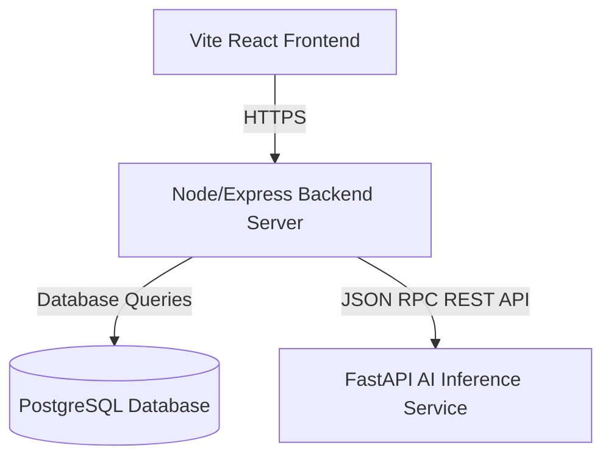

# ProspectIQ AI - Enterprise Banking System Architecture

This document describes the high-level architecture of ProspectIQ AI, aligned with the design requirements of IDBI Bank Innovate.

## Architecture Highlights
- **Layered Enterprise Reorganization**: Reorganized codebases for scalability, security, and backward-compatible updates.
- **FastAPI AI Inference Layer**: Serving high-fidelity modular analysis engines: TrustLayer, BehaviorIQ, Financial DNA, PriorityIQ, NBAIQ, ExplainIQ, RelationshipIQ, PredictIQ, PortfolioIQ, and SimulationIQ.
- **Node.js Core API Services Layer**: Secure Controller-Service-Repository pattern.
- **React Frontend layer**: Modular feature components structure aligned with official IDBI branding colors.

